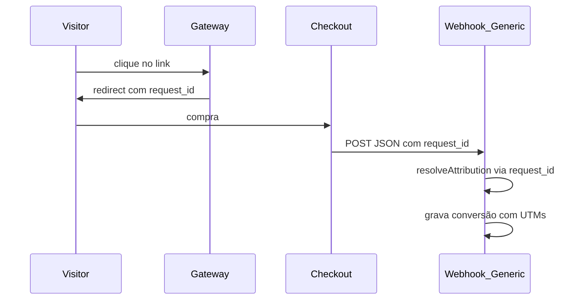

Documentação do webhook para plataformas de checkout customizadas. Use este endpoint quando sua plataforma de vendas não possui integração nativa — basta enviar um POST JSON após cada evento de pagamento.

---

## Visão geral

A plataforma **Generic** permite registrar conversões, reembolsos e chargebacks via webhook JSON. O fluxo de atribuição funciona em três passos:

1. O visitante clica no link de rastreamento → o gateway gera um `request.id` único.
2. O checkout recebe o `request_id` (e opcionalmente UTMs) via parâmetros na URL.
3. Após o pagamento, o checkout envia um POST JSON para a URL do webhook com o mesmo `request_id`.



---

## Endpoint

| Propriedade | Valor |
| --- | --- |
| **URL** | `https://{dominio-primario}/api/webhook/{code}` |
| **Método recomendado** | `POST` |
| **Content-Type recomendado** | `application/json` |

- `{dominio-primario}` — domínio primário configurado no projeto.
- `{code}` — código único de 16 caracteres gerado ao criar a plataforma de vendas no dashboard.

> **Nota:** a rota aceita qualquer método HTTP. Também é possível enviar `application/x-www-form-urlencoded`, mas o contrato documentado é JSON via POST.

A URL completa é exibida no dashboard após salvar a plataforma de vendas do tipo **Generic**.

---

## Payload — campos do body

Todos os campos são enviados no corpo da requisição (body).

### Campos principais

| Campo | Tipo | Obrigatório | Descrição |
| --- | --- | --- | --- |
| `event` | string | Sim | Evento da transação. Valores reconhecidos: `paid`, `refunded`, `chargeback`. |
| `transaction_id` | string | Recomendado | ID único do pedido/transação. Usado para deduplicação. |
| `value` | number | Recomendado | Valor da transação. Arredondado para 2 casas decimais. Default: `0`. |
| `currency` | string | Opcional | Código da moeda (ex: `BRL`, `USD`). Convertido para uppercase. Vazio → `null`. |
| `request_id` | string | Recomendado | ID do clique original para atribuição de UTMs e dados de campanha. |
| `payment_method` | string | Opcional | Método de pagamento utilizado. Ver [valores aceitos](#payment_method--valores-aceitos). |

### Objeto `customer` (opcional)

| Campo | Tipo | Descrição |
| --- | --- | --- |
| `customer.name` | string | Nome do comprador |
| `customer.email` | string | E-mail do comprador |
| `customer.phone` | string | Telefone do comprador |
| `customer.address.street` | string | Logradouro |
| `customer.address.city` | string | Cidade |
| `customer.address.state` | string | Estado |
| `customer.address.zip` | string | CEP |
| `customer.address.country` | string | País |

### Exemplo completo

```json
{
  "event": "paid",
  "transaction_id": "order_123",
  "value": 99.9,
  "currency": "BRL",
  "request_id": "550e8400-e29b-41d4-a716-446655440000",
  "payment_method": "credit_card",
  "customer": {
    "name": "Jane Doe",
    "email": "jane@example.com",
    "phone": "+5511999999999",
    "address": {
      "street": "Rua Example 1",
      "city": "São Paulo",
      "state": "SP",
      "zip": "01000-000",
      "country": "BR"
    }
  }
}
```

---

## Eventos e status

| `event` | Status gravado | Comportamento |
| --- | --- | --- |
| `paid` | `paid` | Conversão registrada. Dispara triggers e pixels configurados. |
| `refunded` | `refunded` | Conversão registrada com status de reembolso. |
| `chargeback` | `chargeback` | Conversão registrada com status de chargeback. |
| Qualquer outro (`pending`, `cancelled`, etc.) | — | Evento ignorado. Nenhuma conversão é gravada. |

### Respostas de sucesso (HTTP 200)

**Pagamento confirmado:**

```json
{
  "ok": true,
  "id": "<conversion-id>"
}
```

**Reembolso ou chargeback:**

```json
{
  "ok": true,
  "id": "<conversion-id>",
  "status": "refunded"
}
```

```json
{
  "ok": true,
  "id": "<conversion-id>",
  "status": "chargeback"
}
```

**Evento não reconhecido (ignorado):**

```json
{
  "ok": true,
  "ignored": true
}
```

### Deduplicação

Se a mesma combinação de `(projectId, webhookId, transactionId, status)` já foi registrada, a API retorna **HTTP 409**:

```json
{
  "error": "DUPLICATE_CONVERSION",
  "transactionId": "order_123"
}
```

Recomenda-se sempre enviar `transaction_id` para evitar registros duplicados e permitir reenvio seguro.

---

## `payment_method` — valores aceitos

| Valor enviado | Valor armazenado |
| --- | --- |
| `credit_card` | `credit_card` |
| `pix` | `pix` |
| `boleto` | `boleto` |
| `paypal` | `paypal` |
| `apple_pay` | `apple_pay` |
| `other` | `other` |
| ausente ou desconhecido | `null` |

---

## UTMs e atribuição

**UTMs não devem ser enviados no body do webhook.** O adapter Generic usa `request_id` como chave de rastreamento. Os dados de campanha (UTMs, click IDs, subs, geo, etc.) são resolvidos automaticamente a partir do clique original.

### Como funciona

1. Na **URL de checkout**, o sistema injeta parâmetros configuráveis (via _Parâmetros_ no dashboard).
2. O checkout deve **capturar e persistir** o `request_id` recebido na URL.
3. Ao confirmar o pagamento, o checkout envia o `request_id` de volta no webhook.
4. O sistema faz lookup do clique original e preenche UTMs, click IDs, dados de anúncio, geolocalização e demais campos de atribuição na conversão.

Se `request_id` estiver ausente ou não corresponder a nenhum clique conhecido, a conversão é gravada **sem atribuição** (UTMs vazios).

### Preset padrão de parâmetros de checkout

Ao selecionar a plataforma **Generic** no dashboard, os seguintes parâmetros são sugeridos automaticamente:

| Parâmetro na URL de checkout | Macro (valor) |
| --- | --- |
| `request_id` | `{request.id}` |
| `utm_source` | `{request.utmSource}` |
| `utm_medium` | `{request.utmMedium}` |
| `utm_campaign` | `{request.utmCampaign}` |
| `utm_term` | `{request.utmTerm}` |
| `utm_content` | `{request.utmContent}` |

Exemplo de URL de checkout resultante:

```text
https://seu-checkout.com/produto?request_id=abc-123&utm_source=facebook&utm_medium=cpc&utm_campaign=promo
```

O checkout deve guardar `request_id=abc-123` e incluí-lo no webhook após o pagamento.

### Macros adicionais disponíveis na URL de checkout

Além das UTMs, é possível usar qualquer macro `{request.<campo>}` na configuração de parâmetros do checkout:

| Campo | Descrição |
| --- | --- |
| `id` | Request ID (mesmo valor de `request_id`) |
| `linkId` | ID do link |
| `clickId` | Click ID |
| `trafficSource` | Origem do tráfego |
| `sub1` – `sub8` | Sub IDs 1 a 8 |
| `adPlatform` | Plataforma de anúncios |
| `adAccountId` | ID da conta de anúncios |
| `campaignId` | ID da campanha |
| `adsetId` | ID do conjunto de anúncios |
| `adId` | ID do criativo |
| `visitorId` | ID do visitante |
| `country` | País |
| `city` | Cidade |
| `state` | Estado |
| `browser` | Navegador |
| `os` | Sistema operacional |
| `device` | Tipo de dispositivo |
| `browserLanguage` | Idioma do navegador |
| `host` | Host da requisição |
| `path` | Path da requisição |

Formato: `{request.<campo>}` — exemplo: `{request.clickId}`, `{request.sub1}`.

> Esses campos são injetados na URL de checkout, **não** no body do webhook. O webhook precisa apenas devolver o `request_id` para que a atribuição seja resolvida.

---

## Erros HTTP

| Status | `error` | Quando ocorre |
| --- | --- | --- |
| 404 | `SALES_PLATFORM_NOT_FOUND` | Código do webhook inválido ou plataforma não encontrada |
| 404 | `PROJECT_NOT_FOUND` | Projeto associado não encontrado |
| 404 | `TEAM_NOT_FOUND` | Time associado não encontrado |
| 404 | `CONFIG_NOT_FOUND` | Configuração do projeto não encontrada |
| 400 | `UNKNOWN_NETWORK` | Tipo de plataforma desconhecido |
| 400 | `PARSE_ERROR` | Erro ao processar dados da conversão |
| 409 | `DUPLICATE_CONVERSION` | Transação com mesmo ID e status já registrada |
| 502 | `CURRENCY_CONVERSION_FAILED` | Falha ao converter moeda estrangeira para a moeda do projeto |

---

## Guia de integração

### Passo a passo

1. **Criar plataforma de vendas** — No dashboard, crie uma plataforma do tipo **Generic**.
2. **Configurar parâmetros de checkout** — Garanta que `request_id={request.id}` está nos parâmetros (preset padrão). Adicione UTMs se desejar repassá-las ao checkout.
3. **Copiar URL do webhook** — Após salvar, copie a URL exibida em _URL do webhook_.
4. **Capturar `request_id` no checkout** — Leia o parâmetro `request_id` da URL quando o visitante chegar ao checkout e associe-o ao pedido.
5. **Enviar webhook após pagamento** — Faça POST JSON para a URL do webhook com `event: "paid"` e o `request_id` capturado.
6. **Tratar respostas** — Verifique `ok: true` para sucesso, `ignored: true` para eventos não suportados, e `409` para duplicatas.

### Eventos adicionais

- **Reembolso:** envie `event: "refunded"` com o mesmo `transaction_id` do pagamento original.
- **Chargeback:** envie `event: "chargeback"` com o mesmo `transaction_id`.

### Boas práticas

- Sempre envie `transaction_id` para deduplicação e reenvio seguro.
- Sempre envie `request_id` para garantir atribuição de campanha.
- Use `Content-Type: application/json`.
- Implemente retry com backoff para erros 5xx; não reenvie em respostas `409` (já registrado) ou `ignored: true`.

---

## Referência rápida

```text
POST https://{dominio}/api/webhook/{code}
Content-Type: application/json

{
  "event": "paid",
  "transaction_id": "order_123",
  "value": 99.9,
  "currency": "BRL",
  "request_id": "550e8400-e29b-41d4-a716-446655440000",
  "payment_method": "credit_card"
}
```

Resposta esperada:

```json
{ "ok": true, "id": "conv_abc123" }
```